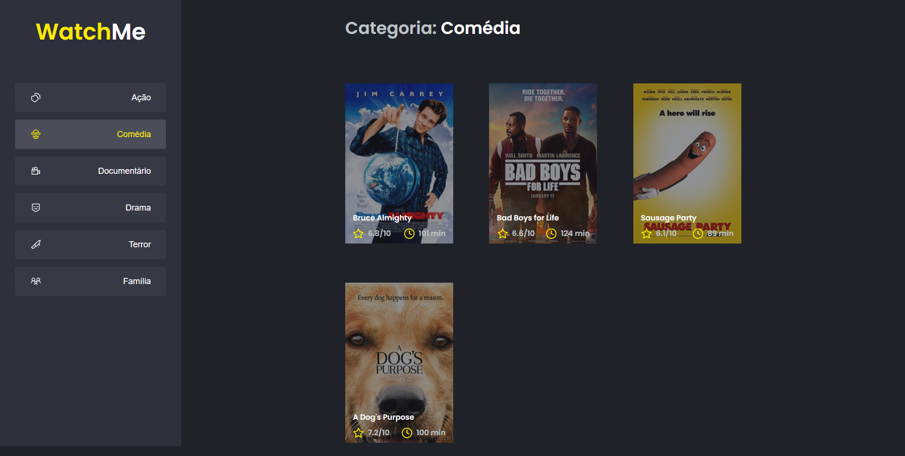

	<a href="#sobre"> Sobre </a>&nbsp;&nbsp;&nbsp;|&nbsp;&nbsp;&nbsp;
  <a href="#techs"> Tecnologias </a>&nbsp;&nbsp;&nbsp;|&nbsp;&nbsp;&nbsp;
  <a href="#run"> Como usar </a>&nbsp;&nbsp;&nbsp;

  

  

## Sobre 🚀 <a name="sobre" />

O **WatchMe** é o desáfio adicional do primeiro capítulo do **Ignite** da [Rocketseat](https://rocketseat.com.br/). Nesse desafio foram implementadas algumas funcionalidades para uma listagem de filmes, como por exemplo, os conceitos de componentização.

## Techs ​⚙ ​<a name="techs" />

- TypeScript
- ReactJS
- Axios

## Instalação e execução ​ℹ️ ​<a name="run" />

1. Faça um clone desse repositório;
2. Entre na pasta rodando `cd ignite-react-desafio-02`;
3. Rode `yarn` para instalar as dependências;
4. Rode `yarn server` para rodar a api fake;
5. Rode `yarn dev`;
